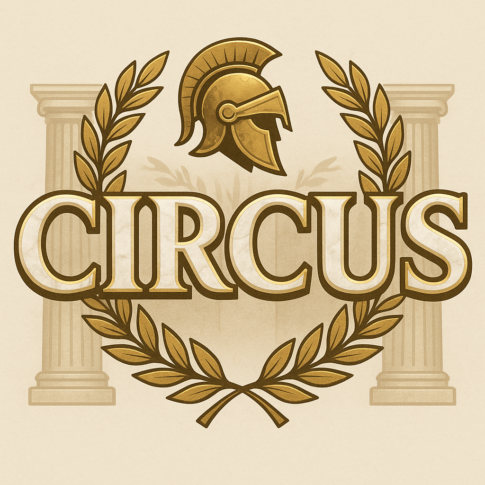

# circus

<div align="center">
  
</div>

**circus** is a multi-platform humanoid robot soccer simulator built on top of MuJoCo. It supports mixed teams of robots, enabling realistic and flexible RoboCup simulations. Designed for research and development, circus provides accurate physics, advanced robot models, and seamless integration across operating systems.

## Install Dependencies

```bash
sudo apt update
sudo apt install qt6-base-dev qt6-base-dev-tools libqt6widgets6 libqt6openglwidgets6
sudo apt install libeigen3-dev
sudo apt install libyaml-cpp-dev
sudo apt install libcurl4-openssl-dev
sudo apt install nlohmann-json3-dev
```

## Build and Run Instructions
You can build and run the simulator with the following commands:
```bash
cmake -B build -S . && cmake --build build -j$(nproc)

./build/main
```
or you can directly use the .sh file:
```
./build_and_run.sh
```
